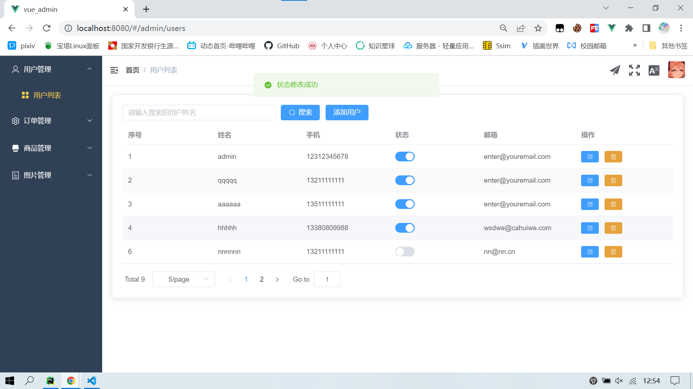
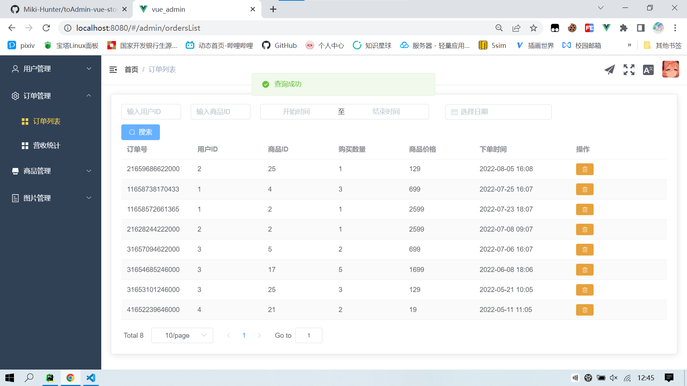
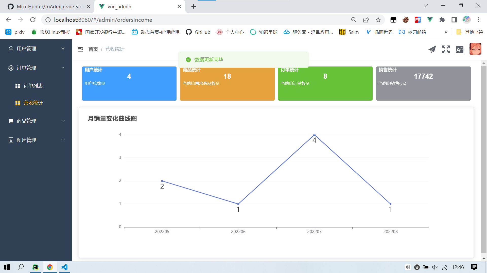
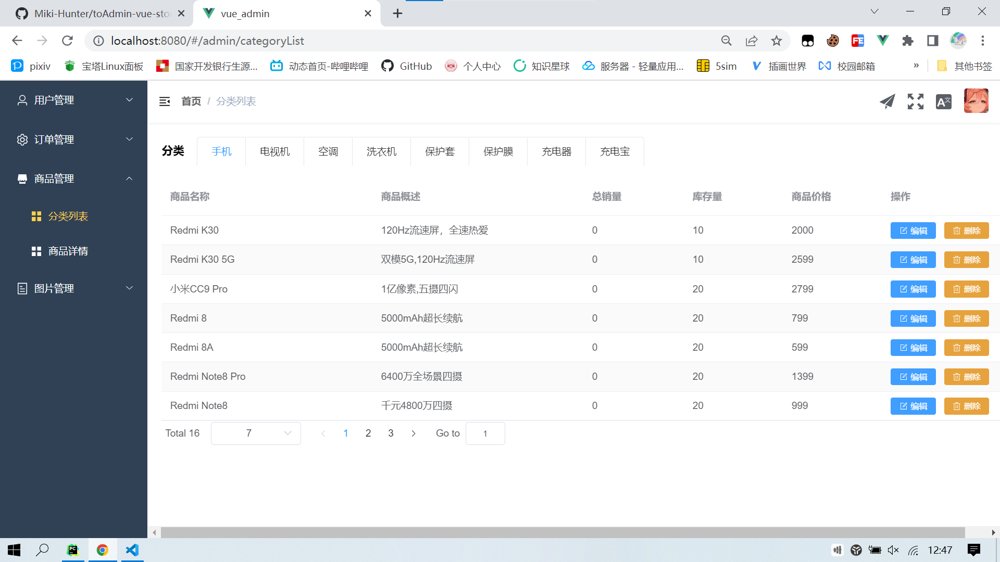
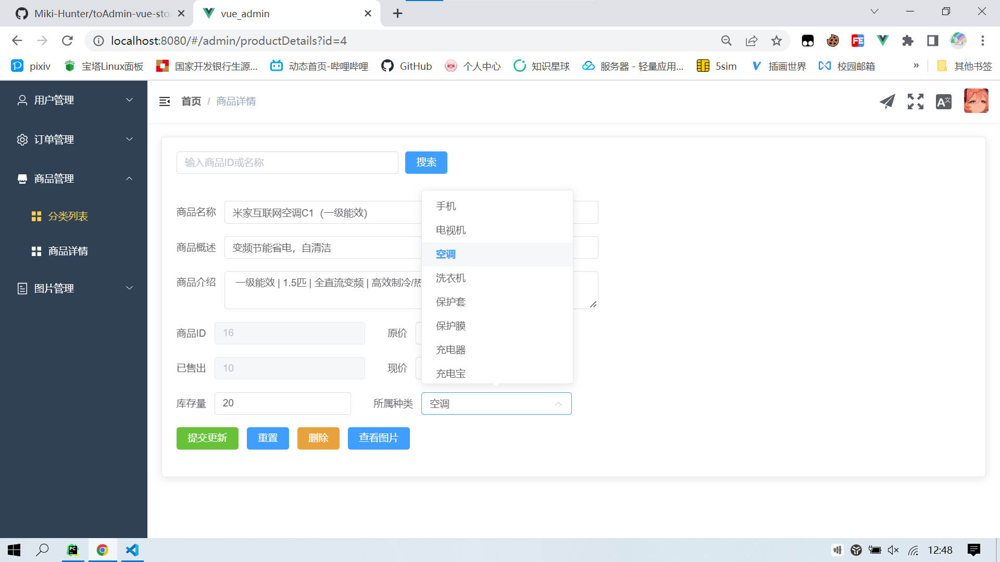
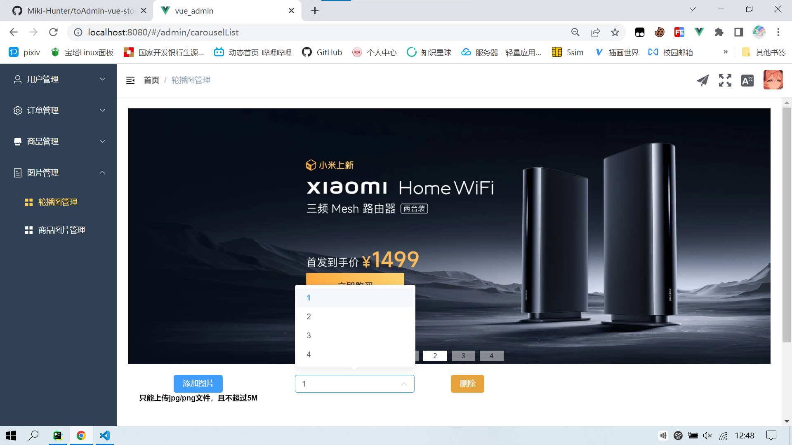
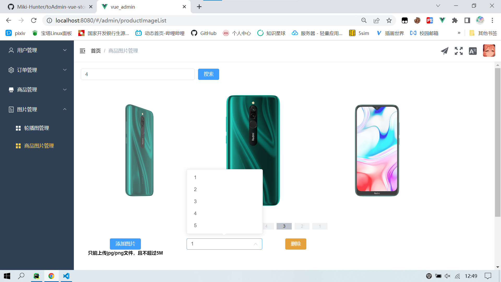

# 效果预览

基于 ` Vue3 + Element-Plus `实现，功能还未全部完善  
[前端-toAdmin1.0](https://github.com/Miki-Hunter/toAdmin-vue-store-1.0)  
[前端-toUser1.0](https://github.com/Miki-Hunter/toUser-vue-store-1.0)  
[后端](https://github.com/Miki-Hunter/store-server-django-Version1.0) ` Django + DRF `实现  

### 用户管理
  

### 订单列表

### 订单统计
  

### 商品列表

### 商品详情

### 轮播图管理

### 商品图片管理

